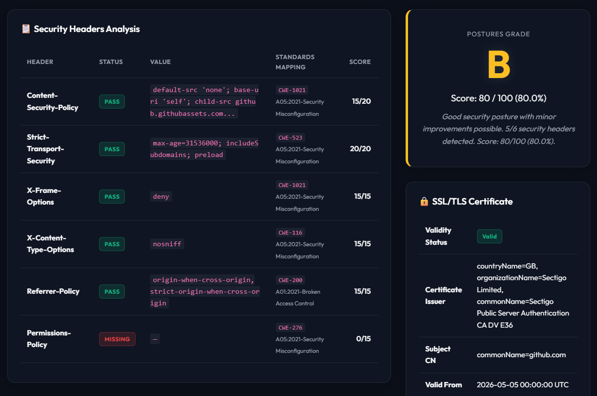
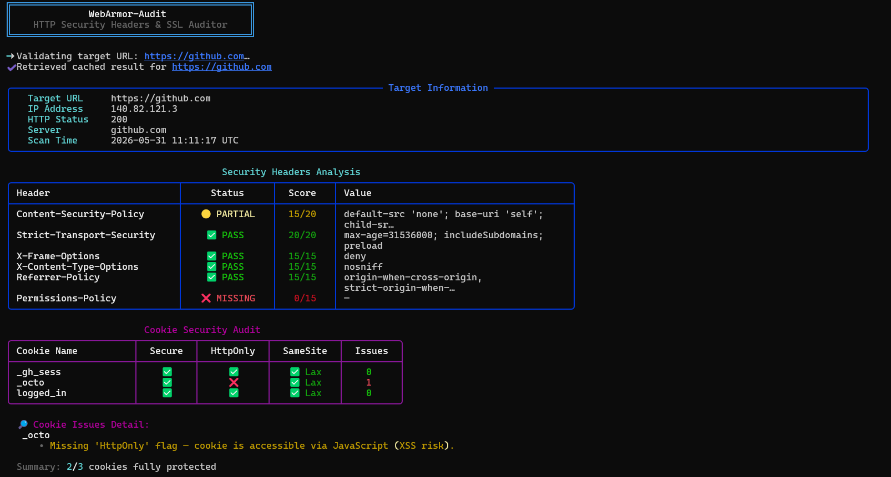
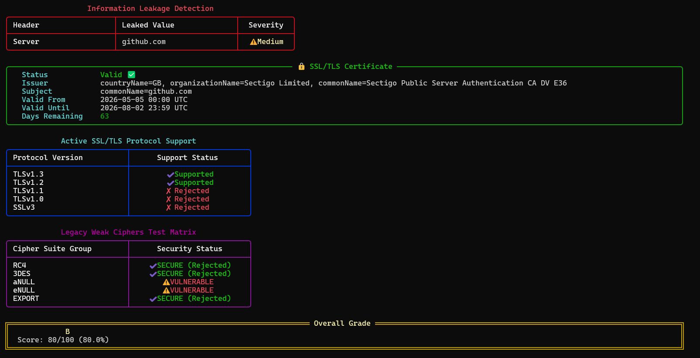

<div align="center">

# WebArmor-Audit

### Production-Grade HTTP Security Headers Auditor & SSL/TLS Inspector

[](https://python.org)
[](LICENSE)
[](https://owasp.org)

**A professional, Zero-Dependency core CLI security scanner designed for modern DevSecOps. It audits websites for HTTP security headers, CORS vulnerability compliance, security.txt configuration, SSL/TLS certificate validity and active protocols/cipher suite vulnerabilities, CSP bypass risks, redirect downgrades, cookie safety, and technology information leakage. Supports beautiful dark-mode HTML, JSON, SARIF, and Markdown reports with concurrent bulk scanning and thread-safe caching.**

---
### 🖥️ Dashboard & Report Preview

#### 🌐 Interactive HTML Dashboard Report


#### 💻 Rich CLI Terminal Interface
<p align="center">
  
  
</p>

---

[Key Features](#-key-features) •
[Compare](#-how-webarmor-audit-compares) •
[Installation](#-installation) •
[Usage Recipes](#-usage-recipes) •
[Advanced Audits](#-advanced-audits--checks) •
[Configuration Profiles](#-configuration-profiles-toml) •
[CI/CD & DevSecOps](#-cicd-integration--devsecops) •
[Output Formats](#-output-formats) •
[Project Structure](#-project-structure)

</div>

---

## 🎯 Key Features

| Feature | Capabilities |
| :--- | :--- |
| **🔍 Security Header Audit** | Inspects 6 critical headers (`CSP`, `HSTS`, `X-Frame-Options`, `X-Content-Type-Options`, `Referrer-Policy`, `Permissions-Policy`) with a smart grading system (A+ → F). |
| **🔒 CORS Compliance** | Scans for origin misconfigurations, wildcard bindings with credentials, insecure protocols, and origin reflections. |
| **🛡️ CSP Bypass Evaluator** | Parses Complex Content Security Policies, checking for wildcards, insecure CDNs (like `unpkg.com` or `cdnjs.cloudflare.com`), lack of standard fallback directives (`default-src`, `object-src`), and unsafe evaluators (`unsafe-inline`, `unsafe-eval`). |
| **📂 security.txt Validation** | Validates RFC 9116 compliance for `.well-known/security.txt`, checking expiration timestamps, mandatory fields, contacts, and signature verification. |
| **🌐 Protocol Auditing** | Identifies advanced server capability through socket-level ALPN verification for **HTTP/2** and response header parsing for **HTTP/3 (Alt-Svc)**. |
| **🔒 SSL/TLS Active Scan** | Inspects certificate metadata and actively probes for supported protocol versions (TLS 1.0 - 1.3, SSLv3) and legacy weak ciphers (RC4, 3DES, NULL/anonymous, EXPORT) to prevent BEAST/SWEET32 attacks. |
| **💥 Smart Path Fuzzer** | Active concurrent fuzzing of 20+ high-value paths (e.g. `.env`, `.git/HEAD`, backups) with body keyword verification to avoid false positives. |
| **🎯 CWE / OWASP Mapping** | Maps all discovered vulnerabilities and recommendations to CWE IDs and OWASP Top 10 classifications. |
| **🛡️ WAF Fingerprinting** | Fingerprints Web Application Firewalls (Cloudflare, AWS WAF, Akamai, Imperva, etc.) via cookie and header signatures. |
| **🔗 Redirect Chain Tracker** | Traces multi-hop redirects, alerts on security protocol downgrades (HTTPS to HTTP), and detects credential leaks in the referral path. |
| **🍪 Cookie & Leakage Scan** | Inspects cookies for `Secure`, `HttpOnly`, and `SameSite` flags. Detects framework/webserver information leaks (e.g. `Server`, `X-Powered-By`, `X-AspNet-Version`). |
| **⚡ Thread-Safe Caching** | Locally caches audit reports in `.webarmor_cache.json` with custom TTL. Fully thread-safe using locking primitives for parallel execution. |
| **🚀 Concurrent Bulk Scan** | Scans multiple target URLs concurrently using a python `ThreadPoolExecutor` and generates a consolidated interactive HTML dashboard. |
| **🎨 Multi-Format Reports** | Exports to console-friendly **Markdown**, programmatic **JSON**, premium interactive **Dark-Neon HTML**, and **SARIF** (fully compatible with GitHub Security Alerts). |
| **⚙️ Config Profiles** | Customize grade thresholds and grading weights, or track custom proprietary headers via simple **TOML** configurations. |
| **🤖 CI/CD Fail-Safe** | Return non-zero exit codes using `--fail-under` or `--fail-score` to break CI pipelines when targets fall short of compliance thresholds. |

---

## ⚖️ How WebArmor-Audit Compares

| Feature / Capability | WebArmor-Audit | Mozilla Observatory | OWASP ZAP | Nikto |
| :--- | :---: | :---: | :---: | :---: |
| **Zero-Dependency (Pure Python)** | ✅ **Yes** | ❌ No | ❌ No (Java) | ❌ No (Perl) |
| **Active SSL/TLS Cipher Probing** | ✅ **Yes** | ❌ No (Passive Only) | ⚠️ Partial | ⚠️ Limited |
| **Smart Fuzzer (No False 404s)** | ✅ **Yes** | ❌ No | ⚠️ Generic | ⚠️ High Noise |
| **Automated WAF Fingerprinting** | ✅ **Yes** | ❌ No | ❌ No | ⚠️ Limited |
| **SARIF Native Export (CI/CD)** | ✅ **Yes** | ❌ No | ✅ Yes | ❌ No |
| **Execution Speed** | ⚡ **Ultra Fast** | ⚠️ Network Dependent | 🐢 Heavy/Slow | 🐢 Very Slow |
| **Premium Dark-Neon HTML UI** | ✅ **Yes** | ✅ Yes (Web Only) | ❌ No | ❌ No |

---

## 📋 Security Checks Overview

### 1. HTTP Security Headers
*   **Content-Security-Policy (CSP):** Mitigates XSS, frame injection, and clickjacking. Evaluates directive strength.
*   **Strict-Transport-Security (HSTS):** Enforces HTTPS, validates `max-age` and `includeSubDomains`.
*   **X-Frame-Options (XFO):** Prevents clickjacking by restricting frame embedding (`DENY` or `SAMEORIGIN`).
*   **X-Content-Type-Options (XCTO):** Blocks MIME-type sniffing by enforcing `nosniff`.
*   **Referrer-Policy:** Controls information leakage in cross-origin HTTP requests.
*   **Permissions-Policy:** Limits hardware APIs and features accessible in the browser context.

### 2. CORS (Cross-Origin Resource Sharing)
*   Verifies that `Access-Control-Allow-Origin` is configured safely.
*   Alerts on dangerous configurations like wildcard origins combined with `Access-Control-Allow-Credentials: true`.
*   Detects insecure HTTP protocols defined in allowed origins.

### 3. security.txt (RFC 9116)
*   Checks for file availability under `.well-known/security.txt`.
*   Parses required fields: `Contact`, `Expires`, `Preferred-Languages`.
*   Validates expiration timestamp to warn on outdated configurations.

### 4. SSL/TLS Active Scanner & Certificate Analysis
*   Extracts SSL issuer name, valid-from, valid-to, and remaining lifespan.
*   **Active Protocol Probing:** Discovers supported and rejected protocol versions (TLS 1.0, TLS 1.1, TLS 1.2, TLS 1.3, SSLv3).
*   **Weak Cipher Scan:** Detects if the server accepts dangerous/legacy cipher suites (RC4, 3DES, NULL/anonymous, EXPORT).
*   Generates security alerts if certificate is invalid, expiring, or if the server supports legacy SSL/TLS versions or weak ciphers.

### 5. Smart Path Fuzzer (Sensitive File Scanning)
*   **Concurrent Probing:** Evaluates exposure of 20+ sensitive target directories and configuration backups in parallel.
*   **Keyword Response Matching:** Checks downloaded file buffers for specific markers (e.g. `DB_PASSWORD`, `ref:`, `<?php`) to completely prevent false positive listings.
*   Scans for: `.env`, `.git/HEAD`, `.git/config`, `wp-config.php.bak`, database SQL dumps, Docker blueprints, and composer/npm configurations.

### 6. CWE & OWASP Standards Mapping Engine
*   Maps security missing headers, cookies without security properties, information disclosures, CORS bugs, and SSL parameters directly to their official catalog numbers:
    *   `CWE-1021` (Restriction of Object Embedding)
    *   `CWE-523` (Insecure Protocol Reconstruction)
    *   `CWE-200` (Information Exposure)
    *   `CWE-942` (Permissive CORS Policy)
    *   `CWE-327` (Use of Broken Cryptographic Algorithm)
*   Integrates findings with OWASP Top 10 categories (e.g., `A01:2021-Broken Access Control`, `A02:2021-Cryptographic Failures`, `A05:2021-Security Misconfiguration`).

### 7. Active WAF (Web Application Firewall) Fingerprinting
*   Passively and actively inspects response headers and cookies.
*   Identifies active presence of cloud protection shields:
    *   **Cloudflare:** `__cfduid`, `cf-ray`, `cf-cache-status`, `Server: cloudflare`.
    *   **AWS WAF / ELB:** `AWSALB`, `AWSALB-CORS`, `AWSELB`.
    *   **Akamai:** `X-Akamai-Transformed`, `Akamai-Origin-Hop`.
    *   **Imperva Incapsula:** `visid_incap`, `incap_ses`, `X-CDN`.
    *   **ModSecurity / FortiWeb / F5 BIG-IP ASM**.

---

## 🚀 Installation

### Prerequisites
*   **Python 3.9+** (Supports `3.9`, `3.10`, `3.11`, `3.12`, `3.13`)
*   **pip** (Standard python package manager)

### Setup
```bash
# 1. Clone the repository
git clone https://github.com/mosawalhi7/webarmor-audit.git
cd webarmor-audit

# 2. Create a virtual environment
python -m venv venv

# 3. Activate the virtual environment
# On Linux/macOS:
source venv/bin/activate
# On Windows:
venv\Scripts\activate

# 4. Install dependencies (Only requests and rich are required)
pip install -r requirements.txt
```

---

## 💻 Usage Recipes

### 1. Basic Single Target Scan
Inspects a single website with default settings, producing beautiful Rich console output and saving a Markdown report.
```bash
python main.py https://example.com
```

### 2. Premium Interactive HTML Report
Generates a highly-stylized interactive Dark-Neon HTML report containing nested sections, colorized grading badges, and recommendation collapsibles.
```bash
python main.py https://example.com -f html -o reports/report.html
```

### 3. Programmatic JSON Output
Generates structured JSON data ideal for processing with other scripts or forwarding to telemetry storage.
```bash
python main.py https://example.com -f json -o reports/report.json
```

### 4. GitHub Actions (SARIF) Integration
Generates a SARIF static analysis log that can be uploaded directly to GitHub's code-scanning tab.
```bash
python main.py https://example.com -f sarif -o webarmor-results.sarif
```

### 5. Concurrent Bulk Scanning
Scan a list of targets (one per line) from a text file concurrently. Generates individual target reports and a central index dashboard.
```bash
python main.py -b targets_sample.txt -f html -o bulk_summary.html
```

### 6. Loading custom configurations (TOML)
Use custom weights for scoring and adjust grading thresholds for strict compliance environments.
```bash
python main.py https://example.com -c profile_sample.toml
```

### 7. Customizing Cache Options
Audit data is cached locally to prevent aggressive repeating queries. You can configure or disable caching.
```bash
# Set cache TTL to 1 hour (3600 seconds)
python main.py https://example.com --cache-ttl 3600

# Bypass cache completely
python main.py https://example.com --no-cache
```

---

## ⚙️ Command Line Options

```
usage: webarmor-audit [-h] [-o OUTPUT] [-t TIMEOUT] [--no-ssl] [--insecure]
                      [-f {markdown,json,html,sarif}] [--fail-under {A+,A,B,C,D,F}]
                      [--fail-score FAIL_SCORE] [-b BULK] [-c CONFIG]
                      [--no-cache] [--cache-ttl CACHE_TTL] [-v]
                      [url]

WebArmor-Audit — Audit HTTP security headers and SSL/TLS certificate
configuration for any URL.

positional arguments:
  url                   Target URL to audit (e.g. https://example.com).

options:
  -h, --help            show this help message and exit
  -o, --output OUTPUT   Output path for the report (default: audit_report.md).
  -t, --timeout TIMEOUT Request timeout in seconds (default: 15).
  --no-ssl              Skip SSL certificate inspection.
  --insecure            Disable SSL certificate verification for the HTTP request.
  -f, --format {markdown,json,html,sarif}
                        Output report format (default: markdown).
  --fail-under {A+,A,B,C,D,F}
                        Exit with code 2 if the overall grade is below this threshold.
  --fail-score FAIL_SCORE
                        Exit with code 2 if the overall score percentage is below this threshold (0-100).
  -b, --bulk BULK       Path to a text file containing target URLs (one per line) for concurrent bulk scanning.
  -c, --config CONFIG   Path to a custom TOML profile configuration file (e.g. config.toml).
  --no-cache            Disable retrieving results from cache.
  --cache-ttl CACHE_TTL
                        Cache TTL in seconds (default: 300).
  -v, --version         show program's version number and exit
```

---

## 🔧 Configuration Profiles (TOML)

You can customize the rating engine to enforce strict or relaxed standards. Create a TOML file (like `profile_sample.toml`):

```toml
[headers]
# Define custom scoring weights (The total possible score is the sum of these weights)
Content-Security-Policy = 30
Strict-Transport-Security = 20
X-Frame-Options = 15
X-Content-Type-Options = 10
Referrer-Policy = 10
Permissions-Policy = 15

# Track custom headers (arbitrary name & weight)
X-XSS-Protection = 5

[thresholds]
# Adjust grade thresholds (percentages 0-100)
"A+" = 95
A = 85
B = 75
C = 60
D = 45
F = 0
```

Deploy the profile using the CLI:
```bash
python main.py https://example.com -c profile_sample.toml
```

---

## 🤖 CI/CD Integration & DevSecOps

Integrate WebArmor-Audit into automated pipelines (e.g. GitHub Actions, GitLab CI/CD) to prevent security regressions before code is pushed to production.

### Fail-on-Threshold
If a target's grade or score is lower than configured, WebArmor-Audit will print a failure warning and exit with code **`2`**, failing your CI build.

```bash
# Fail build if grade is worse than A
python main.py https://example.com --fail-under A

# Fail build if compliance score is less than 85%
python main.py https://example.com --fail-score 85.0
```

### GitHub Actions Workflow Example
Create a `.github/workflows/security-audit.yml`:
```yaml
name: Security Header Audit

on:
  push:
    branches: [ main ]
  schedule:
    - cron: '0 0 * * 1' # Run every Monday at midnight

jobs:
  audit:
    runs-on: ubuntu-latest
    steps:
      - name: Checkout repository
        uses: actions/checkout@v3

      - name: Set up Python
        uses: actions/setup-python@v4
        with:
          python-level: '3.11'

      - name: Install dependencies
        run: |
          pip install -r requirements.txt

      - name: Run Security Audit
        run: |
          python main.py https://mysite.com --fail-under B -f sarif -o results.sarif

      - name: Upload SARIF report to GitHub Code Scanning
        uses: github/code-scanning-upload-sarif@v2
        if: always()
        with:
          sarif_file: results.sarif
```

---

## 📊 Grading & Scoring Logic

The grading engine normalizes the total security header points scored to a percentage (0% to 100%) and maps it to a grade:

| Grade | Percentage Threshold | Description |
| :---: | :---: | :--- |
| **A+** | ≥ 95% | Excellent — Outstanding headers setup with zero warnings. |
| **A** | 85% – 94% | Very Good — Core protections configured correctly. |
| **B** | 70% – 84% | Good — Minor configuration optimizations recommended. |
| **C** | 55% – 69% | Moderate — Crucial headers missing or bypassable. |
| **D** | 40% – 54% | Weak — Multiple critical security headers are missing. |
| **F** | < 40% | Critical Vulnerability Exposure — High risk. |

---

## 📁 Project Structure

```
webarmor-audit/
├── main.py                      # Main CLI entry point launcher
├── requirements.txt             # Project runtime dependencies
├── requirements-dev.txt         # Development & testing dependencies
├── pyproject.toml               # Python project configuration
├── profile_sample.toml          # Custom TOML profile sample
├── targets_sample.txt           # Sample file for bulk scans
├── LICENSE                      # MIT license file
├── README.md                    # Project documentation (this file)
├── .github/                     # GitHub integrations
│   └── workflows/
│       └── ci.yml               # Automated CI test suite pipeline
├── tests/                       # Automated unit tests directory
│   ├── conftest.py              # Reusable test fixtures & path overrides
│   ├── test_config.py           # Custom profile override tests
│   ├── test_cookies.py          # Cookie security audits validation
│   ├── test_fuzzer.py           # Path fuzzing mock integration tests
│   ├── test_grader.py           # Score calculations & recommendation mapping tests
│   ├── test_headers.py          # Offline mock headers scan validation
│   └── test_waf.py              # WAF platform detection fingerprint tests
└── webarmor_audit/              # Core audit engine library package
    ├── __init__.py              # Library entry metadata
    ├── __main__.py              # Package executable entry point
    ├── cache.py                 # Thread-safe JSON caching engine (Lock protected)
    ├── cli.py                   # CLI Orchestrator & Rich terminal layout
    ├── config.py                # TOML parser (handles fallback for < Python 3.11)
    ├── constants.py             # Default grading values, weight parameters & headers
    ├── cookies.py               # Cookie flag analyzer (Secure, HttpOnly, SameSite)
    ├── cors.py                  # CORS origin verification engine
    ├── csp_evaluator.py         # Advanced CSP parser & bypass vector evaluator
    ├── exceptions.py            # Custom exception classes
    ├── fuzzer.py                # Smart concurrent path fuzzing engine
    ├── grader.py                # Grading score math and mapping logic
    ├── headers.py               # HTTP header fetcher, URL validator & header analysis
    ├── leakage.py               # Technology signature exposure checker
    ├── models.py                # Dataclasses defining audit records
    ├── protocols.py             # HTTP/2 socket ALPN & HTTP/3 Alt-Svc analyzer
    ├── redirects.py             # Redirect hop tracer & downgrade scanner
    ├── reporter.py              # Export managers (Markdown, HTML, JSON, SARIF)
    ├── security_txt.py          # RFC 9116 compliance parser
    ├── ssl_info.py              # SSL Certificate metadata scraper
    └── waf.py                   # WAF identification & signature detector
```

---

## 🤝 Contributing

Contributions are welcome! Please follow these steps:
1. **Fork** the repository.
2. Create a **feature branch** (`git checkout -b feature/my-new-feature`).
3. **Commit** your changes (`git commit -m "Add some feature"`).
4. **Push** to the branch (`git push origin feature/my-new-feature`).
5. Create a **Pull Request**.

Ensure your code is documented, uses clear type hints, and respects the zero external-dependency design (except for `requests` and `rich`).

---

## ⚠️ Disclaimer

> **This tool is provided for educational and authorized security assessment purposes only.**
>
> WebArmor-Audit is designed to help developers, security engineers, and system administrators evaluate the security posture of web applications they own or have explicit authorization to test.
>
> *   Do **NOT** run this tool against third-party endpoints without prior written authorization.
> *   The author assumes **no liability** for misuse, data leaks, or damage caused by execution of this code.
>   
---

<div align="center">

**Built with ❤️ for the AppSec & DevSecOps community**

🛡️ *Protecting the web, one header at a time.* 🛡️

</div>
